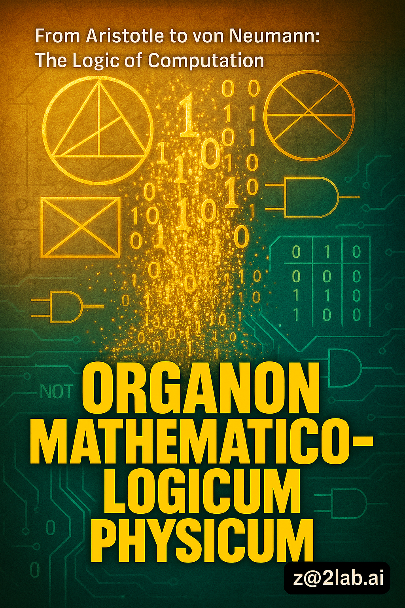

# Organon Mathematico-Logicum Physicum
**Authors**: Jihyuk Im¹, Claude Opus 4²  
¹z@2lab.ai, ²Anthropic  
**Date**: 2025-07-22

## 1 세계는 계산 가능한 것들의 총체이다.

### 1.1 계산 가능한 것은 유한한 단계로 결정될 수 있는 것이다.

#### 1.11 [기원전 300년경] 유클리드, 『원론』(Στοιχεῖα) - 최대공약수를 구하는 유클리드 호제법은 명확한 종료 조건을 가진 최초의 비자명한 알고리즘이다.[^1001]

##### 1.111 호제법은 두 수 a와 b (a > b)에 대해, a를 b로 나눈 나머지 r을 구하고, b와 r에 대해 같은 과정을 반복한다.

##### 1.112 이 과정은 나머지가 0이 될 때 반드시 종료되며, 이때의 제수가 최대공약수이다.

##### 1.113 "명확한 종료 조건"이란 알고리즘이 무한 루프에 빠지지 않고 반드시 끝남을 보장하는 것이다.

#### 1.12 이는 유한한 단계로 문제를 해결하는 기계적 절차의 원형을 보여준다.

##### 1.121 "기계적 절차"란 사고나 창의성 없이 규칙만 따르면 수행할 수 있는 과정이다.

##### 1.122 각 단계는 이전 단계의 결과에만 의존하며, 외부 정보가 필요하지 않다.

#### 1.13 "계산"이란 규칙에 따른 기계적 조작임을 암시적으로 보여주었다.[^1002]

##### 1.131 유클리드는 "알고리즘"이라는 용어를 사용하지 않았지만, 그가 기술한 것은 정확히 알고리즘이었다.

##### 1.132 이는 2000년 후 튜링이 정의할 "효과적 계산가능성"의 최초 사례이다.

### 1.2 논리적 추론은 형식화될 수 있다.

#### 1.21 [기원전 350년경] 아리스토텔레스, 『오르가논』(Ὄργανον) - 삼단논법은 추론을 형식적 규칙으로 체계화했다.[^1003]

##### 1.211 오르가논은 "도구"를 의미하며, 논리를 사고의 도구로 본 최초의 체계적 시도이다.

##### 1.212 삼단논법은 대전제, 소전제, 결론의 3단계 구조를 가진다.

#### 1.22 "모든 A는 B다, 모든 B는 C다, 따라서 모든 A는 C다"는 형식은 논리적 추론의 기계화 가능성을 시사했다.

##### 1.221 이 형식은 내용과 무관하게 형식만으로 타당성이 보장된다.

##### 1.222 Barbara, Celarent, Darii, Ferio 등 유효한 삼단논법의 형식이 14개로 분류되었다.

##### 1.223 이는 추론을 기호 조작으로 환원할 수 있음을 보여주는 최초의 증거이다.

#### 1.23 사고를 형식화할 수 있다는 가능성을 체계적으로 탐구한 최초의 시도였다.[^1004]

##### 1.231 형식화란 내용을 제거하고 순수한 구조만을 남기는 과정이다.

##### 1.232 이는 2200년 후 불 대수와 디지털 논리 회로의 철학적 기초가 된다.

## 2 계산의 본질은 기호의 조작이다.

### 2.1 수는 위치 기반 기호 체계로 표현될 수 있다.

#### 2.11 [820-830년경] 알 콰리즈미, 『인도 숫자에 의한 계산』(Kitāb al-Jam' wa-l-tafrīq bi-ḥisāb al-Hind) - 위치 기수법과 0의 체계적 사용법을 서구에 전파했다.[^2001]

##### 2.111 위치 기수법은 같은 기호가 위치에 따라 다른 값을 나타낸다.

##### 2.112 0은 단순한 "없음"이 아니라 위치를 표시하는 적극적 기호이다.

##### 2.113 이는 유한한 기호로 무한한 수를 표현할 수 있게 했다.

#### 2.12 산술 연산의 단계별 절차를 명시적으로 기술했다.[^2002]

##### 2.121 덧셈은 오른쪽 자리부터 시작하여 자리올림을 처리하는 체계적 절차이다.

##### 2.122 곱셈은 덧셈의 반복으로, 나눗셈은 뺄셈의 반복으로 환원된다.

##### 2.123 각 절차는 유한하고 명확하며 기계적으로 수행 가능하다.

#### 2.13 그의 이름 "al-Khwārizmī"가 라틴어화되어 "algorithmus"가 되었다.[^2003]

##### 2.131 12세기 라틴 번역에서 "Dixit Algorithmi"(알고리즈미가 말하길)로 시작했다.

##### 2.132 이는 특정 인물의 이름이 보편적 개념이 된 드문 사례이다.

### 2.2 추론은 기호의 조합으로 기계화될 수 있다.

#### 2.21 [1274-1276년] 라몬 률(Ramon Llull), 『Ars Magna』(위대한 기술) - 조합론적 방법으로 진리를 발견할 수 있다고 주장했다.[^2004]

##### 2.211 모든 지식을 기본 개념들의 조합으로 분해할 수 있다고 보았다.

##### 2.212 9개의 기본 속성(Bonitas, Magnitudo, Duratio 등)으로 모든 것을 설명하려 했다.

#### 2.22 회전하는 원판을 사용한 기계적 추론 장치 "Ars Magna"를 고안했다.[^2005]

##### 2.221 동심원 디스크를 회전시켜 개념들의 모든 가능한 조합을 생성했다.

##### 2.222 이는 인류 최초의 추론 기계이자, 조합적 탐색의 물리적 구현이었다.

##### 2.223 각 조합은 하나의 명제를 나타내며, 타당성을 체계적으로 검토할 수 있었다.

#### 2.23 라이프니츠가 명시적으로 률의 영향을 인정했다.[^2006]

##### 2.231 라이프니츠는 20세에 『조합술에 관하여』에서 률을 "Doctor Illuminatus"로 칭송했다.

##### 2.232 률의 기계적 추론 아이디어를 보편 기호 체계로 발전시켰다.

## 3 모든 계산은 이진 상태로 환원될 수 있다.

### 3.1 기계적 계산은 물리적으로 실현 가능하다.

#### 3.11 [1642-1645년] 파스칼, 파스칼린(Pascaline) 제작 - 톱니바퀴로 자동 자리올림을 구현한 최초의 실용적 기계식 계산기다.[^3001]

##### 3.111 각 자리수는 10개의 톱니를 가진 바퀴로 표현된다.

##### 3.112 9에서 0으로 넘어갈 때 다음 자리 바퀴를 한 칸 전진시키는 기계적 장치를 고안했다.

##### 3.113 이는 추상적 수학 연산이 순수한 물리적 운동으로 구현될 수 있음을 증명했다.

#### 3.12 덧셈과 보수를 이용한 뺄셈을 수행할 수 있었다.[^3002]

##### 3.121 뺄셈 a-b는 a+(10ⁿ-b)로 변환하여 덧셈으로 처리했다.

##### 3.122 이는 현대 컴퓨터의 2의 보수 연산의 선구적 형태이다.

#### 3.13 약 20대가 제작되어 실제로 사용되었다.[^3003]

##### 3.131 파스칼의 아버지가 세무서에서 사용하기 위해 제작을 의뢰했다.

##### 3.132 상업적으로 성공한 최초의 계산 기계였다.

### 3.2 이진법은 계산의 가장 근본적인 형태이다.

#### 3.21 [1703년] 라이프니츠, "이진 산술의 설명"(Explication de l'Arithmétique Binaire) - 0과 1만으로 모든 수를 표현하는 체계를 서구에서 최초로 체계화했다.[^3004]

##### 3.211 1은 존재를, 0은 무(無)를 나타낸다.

##### 3.212 모든 수는 2의 거듭제곱의 합으로 유일하게 표현된다.

##### 3.213 예: 7 = 111₂ = 1×2² + 1×2¹ + 1×2⁰

#### 3.22 중국의 『역경』과 연결시켜 철학적 의미를 부여했다.[^3005]

##### 3.221 양(陽, ⚊)을 1로, 음(陰, ⚋)을 0으로 대응시켰다.

##### 3.222 64괘는 6비트 이진수로 완벽히 대응된다.

##### 3.223 "신은 1이고, 무는 0이다"라고 하여 이진법에 형이상학적 의미를 부여했다.

#### 3.23 이진법이 계산 기계에 적합할 것이라고 예견했다.[^3006]

##### 3.231 "계산이 매우 단순해져서 기계로 쉽게 구현할 수 있을 것"이라고 기술했다.

##### 3.232 전기 스위치의 on/off 상태로 구현될 것을 200년 전에 예견한 것이다.

### 3.3 모든 추론은 계산으로 환원될 수 있다.

#### 3.31 [1666년] 라이프니츠, "조합술에 관하여"(De Arte Combinatoria) - 모든 추론을 계산으로 환원시킬 수 있는 "보편 문자"(characteristica universalis)를 구상했다.[^3007]

##### 3.311 모든 개념을 소수(prime number)로 표현하고, 복합 개념은 그들의 곱으로 나타낸다.

##### 3.312 예: "인간" = 2, "이성적" = 3이면, "이성적 인간" = 6

##### 3.313 개념 간의 관계는 약수 관계로 판정할 수 있다.

#### 3.32 "계산해 봅시다(Calculemus)"로 철학적 논쟁을 해결할 수 있다고 주장했다.[^3008]

##### 3.321 논쟁이 일어나면 계산으로 누가 옳은지 결정할 수 있다.

##### 3.322 이는 증명 검증기와 자동 정리 증명의 최초 구상이다.

#### 3.33 률의 『Ars Magna』를 명시적으로 언급하며 발전시켰다.[^3009]

##### 3.331 률의 원판을 대수적 기호 체계로 추상화했다.

##### 3.332 기계적 조합에서 논리적 연산으로 발전시켰다.

## 4 사고의 법칙은 대수적으로 표현 가능하다.

### 4.1 논리는 수학의 한 분야이다.

#### 4.11 [1847년] 조지 불, 『논리의 수학적 분석』(The Mathematical Analysis of Logic) - 논리적 명제를 대수 방정식으로 표현하는 방법을 최초로 개발했다.[^4001]

##### 4.111 명제를 변수로, 논리 연산을 대수 연산으로 대응시켰다.

##### 4.112 x + y는 "x 또는 y", xy는 "x 그리고 y"를 의미한다.

##### 4.113 논리적 타당성이 대수적 항등식으로 변환된다.

#### 4.12 논리를 수학의 한 분야로 확립했다.[^4002]

##### 4.121 전통적으로 논리학은 철학의 영역이었다.

##### 4.122 불은 논리학을 기호와 연산의 체계로 재정의했다.

#### 4.13 "논리는 더 이상 철학의 일부가 아니라 수학의 일부다"라고 선언했다.[^4003]

##### 4.131 이는 2000년간의 아리스토텔레스 전통과의 단절을 의미했다.

##### 4.132 논리의 수학화는 논리의 기계화를 가능하게 했다.

### 4.2 사고의 법칙은 0과 1의 연산이다.

#### 4.21 [1854년] 조지 불, 『사고의 법칙』(An Investigation of the Laws of Thought) - AND(∧), OR(∨), NOT(¬) 연산을 대수적으로 정의했다.[^4004]

##### 4.211 x AND y = xy (곱셈)
##### 4.212 x OR y = x + y - xy (배타적 합)
##### 4.213 NOT x = 1 - x (여집합)

#### 4.22 진리값을 1(참)과 0(거짓)으로 표현하는 체계를 확립했다.[^4005]

##### 4.221 x² = x라는 멱등법칙이 성립한다 (참∧참=참, 거짓∧거짓=거짓).

##### 4.222 이는 일반 대수와 다른 불 대수의 특징이다.

##### 4.223 모든 논리식은 0 또는 1의 값만을 가진다.

#### 4.23 클로드 섀넌이 1938년 이를 전기 회로에 적용하여 디지털 컴퓨터의 기초를 놓았다.[^4006]

##### 4.231 스위치의 on/off를 1/0으로 대응시켰다.

##### 4.232 직렬 연결은 AND, 병렬 연결은 OR 연산에 대응된다.

##### 4.233 이로써 모든 논리 연산이 전기 회로로 구현 가능함이 증명되었다.

## 5 수학의 모든 진리는 논리로부터 도출될 수 있다.

### 5.1 논리는 완전하고 일관된 체계로 형식화될 수 있다.

#### 5.11 [1879년] 프레게, 『개념 표기법』(Begriffsschrift) - 현대 술어 논리학을 창시한 혁명적 저작이다.[^5001]

##### 5.111 명제 논리를 넘어 "모든", "어떤"을 다루는 술어 논리를 창안했다.

##### 5.112 함수와 인수의 구분을 논리학에 도입했다.

##### 5.113 이는 수학의 모든 명제를 표현할 수 있는 최초의 완전한 형식 체계였다.

#### 5.12 변수, 함수, 양화사(∀, ∃)를 처음으로 엄밀하게 정의했다.[^5002]

##### 5.121 ∀x는 "모든 x에 대해", ∃x는 "어떤 x가 존재하여"를 의미한다.

##### 5.122 변수의 범위(scope)와 속박(binding) 개념을 도입했다.

##### 5.123 이는 현대 프로그래밍 언어의 변수 개념의 기원이다.

#### 5.13 2차원적 표기법으로 논리적 구조를 시각화했다.[^5003]

##### 5.131 수직선과 수평선으로 논리적 의존 관계를 표현했다.

##### 5.132 이는 구문 트리(syntax tree)의 최초 형태이다.

### 5.2 논리주의 프로그램은 한계를 만났다.

#### 5.21 [1893, 1903년] 프레게, 『산수의 기본 법칙』(Grundgesetze der Arithmetik) I, II권 - 수를 순수 논리적 개념으로 정의하려 시도했다.[^5004]

##### 5.211 0은 "자기 자신과 같지 않은 것들의 집합의 크기"로 정의했다.

##### 5.212 후계 함수를 논리적으로 정의하여 모든 자연수를 구성했다.

#### 5.22 1902년 러셀이 발견한 역설로 체계의 모순이 드러났다.[^5005]

##### 5.221 "자기 자신을 원소로 갖지 않는 모든 집합들의 집합"은 모순을 낳는다.

##### 5.222 이 집합을 R이라 하면, R∈R ↔ R∉R이 된다.

##### 5.223 프레게는 부록에서 "학자에게 일어날 수 있는 가장 슬픈 일"이라고 썼다.

#### 5.23 이 실패가 20세기 수학 기초론 연구를 촉발시켰다.[^5006]

##### 5.231 러셀의 타입 이론, 체르멜로의 집합론 등이 대안으로 제시되었다.

##### 5.232 수학의 기초에 대한 3대 학파(논리주의, 형식주의, 직관주의)가 형성되었다.

### 5.3 논리와 수학의 통합은 부분적으로만 성공했다.

#### 5.31 [1910-1913년] 러셀과 화이트헤드, 『수학 원리』(Principia Mathematica) - 수학을 논리학으로 완전히 환원시키려는 3권 2000페이지의 대작이다.[^5007]

##### 5.311 타입 이론으로 집합을 계층화하여 역설을 회피했다.

##### 5.312 개체, 개체의 집합, 집합의 집합 등으로 위계를 만들었다.

#### 5.32 타입 이론으로 러셀의 역설을 회피했다.[^5008]

##### 5.321 "자기 자신을 원소로 갖는 집합"은 타입 오류로 배제된다.

##### 5.322 이는 현대 프로그래밍의 타입 시스템의 철학적 기원이다.

#### 5.33 362페이지에 이르러서야 "1+1=2"를 증명했다.[^5009]

##### 5.331 *110.643: ⊢ 1 + 1 = 2

##### 5.332 이 증명에는 수백 개의 보조 정리가 필요했다.

##### 5.333 "때로는 1+1=2라는 것이 의심스러울 때 이 증명을 본다"고 러셀은 농담했다.

## 6 형식 체계의 한계가 존재한다.

### 6.1 논리의 한계는 언어의 한계이다.

#### 6.11 [1921년] 비트겐슈타인, 『논리철학논고』(Tractatus Logico-Philosophicus) - 진리표(Wahrheitstafel)를 도입하여 복합 명제의 진리값을 기계적으로 계산하는 방법을 제시했다.[^6001]

##### 6.111 진리표는 모든 가능한 경우를 체계적으로 나열한다.

##### 6.112 n개의 명제에 대해 2ⁿ개의 행이 필요하다.

##### 6.113 이는 완전성(completeness)과 결정가능성(decidability)을 보장한다.

#### 6.12 "세계는 사실들의 총체이지, 사물들의 총체가 아니다"(명제 1.1)는 정보의 이산적 표현과 연결된다.[^6002]

##### 6.121 사실(Tatsache)은 참 또는 거짓의 값을 갖는다.

##### 6.122 이는 정보의 비트 표현의 철학적 정당화이다.

##### 6.123 세계의 상태는 모든 원자적 사실들의 참/거짓 값의 조합으로 결정된다.

#### 6.13 튜링은 케임브리지에서 비트겐슈타인의 강의를 들었고, 1939년 그와 직접 논쟁했다.[^6003]

##### 6.131 논쟁의 주제는 수학에서 모순의 의미였다.

##### 6.132 비트겐슈타인은 모순이 실용적으로 문제없다고 주장했다.

##### 6.133 튜링은 모순이 있는 체계로 다리를 건설하면 무너질 것이라고 반박했다.

### 6.2 진리표는 디지털 논리의 기초이다.

#### 6.21 진리표는 모든 가능한 상태를 명시적으로 나열한다.

##### 6.211 이는 완전한 경우 분석(exhaustive case analysis)이다.

##### 6.212 비결정론적 요소가 개입할 여지가 없다.

#### 6.22 이는 카르노 맵(1953)과 디지털 회로 설계의 기초가 되었다.[^6004]

##### 6.221 카르노 맵은 진리표를 2차원으로 재배열한 것이다.

##### 6.222 인접한 셀들을 묶어 논리식을 최소화한다.

##### 6.223 이는 회로의 게이트 수를 최소화하는 핵심 기법이다.

#### 6.23 원자적 사실(Sachverhalt)의 개념은 비트 단위 정보 표현의 철학적 기초가 되었다.[^6005]

##### 6.231 원자적 사실은 더 이상 분해될 수 없는 최소 단위이다.

##### 6.232 각 원자적 사실은 독립적으로 참 또는 거짓이다.

##### 6.233 이는 정보의 최소 단위인 비트의 개념과 정확히 일치한다.

### 6.3 완전성과 일관성은 양립할 수 없다.

#### 6.31 [1931년] 괴델, "형식적으로 결정 불가능한 명제들에 관하여"(Über formal unentscheidbare Sätze...) - 페아노 산술을 포함하는 무모순 체계는 불완전함을 증명했다.[^6006]

##### 6.311 "이 명제는 증명할 수 없다"는 형태의 명제 G를 구성했다.

##### 6.312 G가 거짓이면 증명 가능하므로 모순이다.

##### 6.313 따라서 G는 참이지만 증명 불가능하다.

#### 6.32 괴델 수를 사용하여 메타수학을 산술화했다.[^6007]

##### 6.321 각 기호에 수를 대응시키고, 명제는 수의 열로 표현한다.

##### 6.322 증명은 명제의 열이므로 더 큰 수로 코드화된다.

##### 6.323 "x는 y의 증명이다"는 술어가 산술적 관계로 표현된다.

#### 6.33 이는 프로그램과 데이터의 구분이 없다는 통찰로 이어졌다.[^6008]

##### 6.331 명제도 수이고, 명제에 대한 명제도 수이다.

##### 6.332 프로그램도 데이터이고, 프로그램을 처리하는 프로그램도 가능하다.

##### 6.333 이는 컴파일러, 인터프리터, 자기 수정 코드의 이론적 기초이다.

## 7 효과적으로 계산 가능한 것의 정의가 컴퓨터다.

### 7.1 계산가능성은 수학적으로 정의될 수 있다.

#### 7.11 [1936년] 튜링, "계산 가능한 수들에 관하여"(On Computable Numbers...) - 보편 튜링 기계(Universal Turing Machine)라는 추상적 계산 모델을 제시했다.[^7001]

##### 7.111 튜링 기계는 테이프, 헤드, 상태, 전이 함수로 구성된다.

##### 7.112 각 단계에서 기호를 읽고, 쓰고, 이동하고, 상태를 바꾼다.

##### 7.113 이 단순한 모델이 모든 계산을 수행할 수 있다.

#### 7.12 정지 문제(Halting Problem)의 결정 불가능성을 증명했다.[^7002]

##### 7.121 "임의의 프로그램이 정지하는지 판단하는 프로그램"은 존재하지 않는다.

##### 7.122 대각선 논법으로 모순을 도출했다.

##### 7.123 이는 계산가능성의 근본적 한계를 보여준다.

#### 7.13 폰 노이만은 이 논문을 읽고 저장 프로그램 개념을 발전시켰다.[^7003]

##### 7.131 튜링의 "테이프에 저장된 프로그램"을 전자 메모리로 구현했다.

##### 7.132 프로그램과 데이터를 같은 메모리에 저장하는 아키텍처를 설계했다.

### 7.2 튜링 기계는 논리적 공간의 물리적 구현이다.

#### 7.21 튜링 기계는 무한한 테이프와 유한한 상태를 가진다.

##### 7.211 무한한 테이프는 잠재적 무한이며, 필요할 때마다 확장된다.

##### 7.212 유한한 상태는 기계의 "마음"에 해당한다.

##### 7.213 이는 유한한 장치가 무한한 계산을 수행할 수 있음을 보여준다.

#### 7.22 각 칸은 비트겐슈타인의 "논리적 장소"(logischer Ort)에 대응한다.[^7004]

##### 7.221 각 테이프 칸은 하나의 원자적 사실을 저장한다.

##### 7.222 전체 테이프는 세계의 상태를 나타낸다.

##### 7.223 계산은 논리적 공간에서의 상태 변화이다.

#### 7.23 정지 문제는 "말할 수 없는 것"의 수학적 구현이다.[^7005]

##### 7.231 정지 여부는 진리값을 갖지만 계산으로 결정할 수 없다.

##### 7.232 이는 비트겐슈타인의 "보여질 수는 있지만 말해질 수 없는 것"과 평행하다.

### 7.3 다양한 계산 모델은 동등하다.

#### 7.31 [1936년] 처치, "초등 수론의 해결 불가능한 문제"(An Unsolvable Problem...) - 람다 계산법(λ-calculus)으로 계산가능성을 독립적으로 정의했다.[^7006]

##### 7.311 함수를 기본 개념으로, 적용(application)과 추상화(abstraction)를 기본 연산으로 한다.

##### 7.312 (λx.M)N은 M에서 x를 N으로 치환함을 의미한다.

##### 7.313 Y 콤비네이터로 재귀를 구현할 수 있다.

#### 7.32 함수형 프로그래밍 언어의 이론적 기초가 되었다.[^7007]

##### 7.321 LISP(1958), ML(1973), Haskell(1990) 등이 람다 계산에 기반한다.

##### 7.322 함수를 일급 객체로 다루는 모든 언어의 기원이다.

#### 7.33 처치-튜링 명제: 모든 효과적 계산 모델은 동등하다.[^7008]

##### 7.331 튜링 기계, 람다 계산, 재귀 함수, 레지스터 기계 등이 모두 같은 계산 능력을 갖는다.

##### 7.332 이는 "계산가능성"이 모델에 무관한 절대적 개념임을 시사한다.

##### 7.333 물리적 처치-튜링 명제: 물리적으로 실현 가능한 모든 계산은 튜링 기계로 시뮬레이션할 수 있다.

### 7.4 물리적 컴퓨터의 설계

#### 7.41 [1837년] 배비지, 해석기관(Analytical Engine) 설계 - 프로그램 가능한 범용 계산 기계를 최초로 설계했다.[^7009]

##### 7.411 Mill(연산장치), Store(기억장치), Control(제어장치)로 구성되었다.

##### 7.412 천공 카드로 프로그램과 데이터를 입력했다.

##### 7.413 조건 분기와 반복을 지원하여 튜링 완전했다.

#### 7.42 에이다 러브레이스가 1843년 최초의 컴퓨터 알고리즘을 작성했다.[^7010]

##### 7.421 베르누이 수를 계산하는 알고리즘을 작성했다.

##### 7.422 "기계는 새로운 것을 창조할 수 없고 프로그램된 것만 수행한다"고 통찰했다.

##### 7.423 그러나 "기계가 작곡을 할 수 있을 것"이라고도 예견했다.

#### 7.43 조건 분기와 반복을 포함한 완전한 튜링 완전 기계였다.[^7011]

##### 7.431 IF-THEN-ELSE 구조를 기계적으로 구현했다.

##### 7.432 카드의 구멍 패턴으로 다음 명령을 결정했다.

##### 7.433 기술적 한계로 제작되지 못했지만, 설계는 완벽했다.

### 7.5 저장 프로그램 컴퓨터의 탄생

#### 7.51 [1945년] 폰 노이만, "EDVAC에 관한 보고서 초안"(First Draft of a Report on the EDVAC) - 프로그램과 데이터를 같은 메모리에 저장하는 구조를 제안했다.[^7012]

##### 7.511 프로그램도 숫자로 코드화하여 메모리에 저장한다.

##### 7.512 CPU는 메모리에서 명령을 읽어 실행한다.

##### 7.513 이는 보편 튜링 기계의 실용적 구현이다.

#### 7.52 튜링의 1936년 논문을 명시적으로 참조했다.[^7013]

##### 7.521 "very important paper by Turing"이라고 인용했다.

##### 7.522 추상적 모델을 공학적 설계로 변환했다.

#### 7.53 현대 컴퓨터 아키텍처의 표준이 되었다.[^7014]

##### 7.531 폰 노이만 아키텍처는 70년 이상 컴퓨터의 기본 구조로 사용되고 있다.

##### 7.532 메모리, CPU, 입출력의 분리는 여전히 유효하다.

### 7.6 추상과 구현의 통합

#### 7.61 저장 프로그램 개념은 튜링의 보편 기계를 전자적으로 실현한 것이다.

##### 7.611 튜링의 "테이프"는 RAM이 되었다.

##### 7.612 "상태"는 CPU 레지스터가 되었다.

##### 7.613 "전이 함수"는 명령어 집합이 되었다.

#### 7.62 메모리 주소는 비트겐슈타인의 "논리적 공간"의 좌표다.[^7015]

##### 7.621 각 주소는 하나의 논리적 장소를 가리킨다.

##### 7.622 포인터는 논리적 공간에서의 참조이다.

#### 7.63 자기 수정 코드는 괴델의 자기 참조를 구현한다.[^7016]

##### 7.631 프로그램이 자신을 수정할 수 있다.

##### 7.632 이는 괴델 수를 통한 자기 참조의 물리적 실현이다.

##### 7.633 컴파일러, 운영체제, 인공지능의 기초가 된다.

## 8 그 이상으로 우리는 침묵해야 한다.

### 8.1 계산할 수 없는 것이 존재한다.

### 8.2 그러나 계산 가능한 것의 영역은 계속 확장되고 있다.

### 8.3 Organon Mathematico-Logicum Physicum의 완성은 시작일 뿐이다.

---

## 레퍼런스

[^1001]: Knuth, D. E. (1997). *The Art of Computer Programming, Volume 1: Fundamental Algorithms* (3rd ed.), p. 318. Addison-Wesley. 크누스는 유클리드 호제법을 "the granddaddy of all algorithms"라고 부르며, 알고리즘이라는 개념의 역사적 기원으로 본다.

[^1002]: Chabert, J. L. (Ed.). (1999). *A History of Algorithms: From the Pebble to the Microchip*, pp. 17-36. Springer. DOI: 10.1007/978-3-642-18192-4

[^1003]: Smith, R. (2020). "Aristotle's Logic". *Stanford Encyclopedia of Philosophy*. https://plato.stanford.edu/entries/aristotle-logic/

[^1004]: Łukasiewicz, J. (1957). *Aristotle's Syllogistic from the Standpoint of Modern Formal Logic* (2nd ed.). Oxford University Press.

[^2001]: Toomer, G. J. (1973). "Al-Khwārizmī, Abū Ja'far Muhammad ibn Mūsā". *Dictionary of Scientific Biography*, Vol. 7, pp. 358-365.

[^2002]: Crossley, J. N., & Henry, A. S. (1990). "Thus spake al-Khwārizmī: A translation of the text of Cambridge University Library Ms. Ii.vi.5". *Historia Mathematica*, 17(2), 103-131. DOI: 10.1016/0315-0860(90)90048-I

[^2003]: Brentjes, S. (2007). "Algebra". *Encyclopaedia of Islam*, THREE. DOI: 10.1163/1573-3912_ei3_COM_0128

[^2004]: Bonner, A. (2007). *The Art and Logic of Ramon Llull: A User's Guide*. Brill. DOI: 10.1163/ej.9789004160156.i-333

[^2005]: Gardner, M. (1958). *Logic Machines and Diagrams*, pp. 1-27. McGraw-Hill. 률의 기계적 추론 장치에 대한 상세한 설명.

[^2006]: Leibniz, G. W. (1666). *Dissertatio de Arte Combinatoria*, p. 7. 라이프니츠는 "Raymundus Lullus"를 명시적으로 언급한다.

[^3001]: Marguin, J. (1994). *Histoire des instruments et machines à calculer*, pp. 48-49. Hermann.

[^3002]: Ifrah, G. (2001). *The Universal History of Computing*, pp. 125-126. John Wiley & Sons.

[^3003]: Mourlevat, G. (1988). *Les machines arithmétiques de Blaise Pascal*. La Française d'Edition et d'Imprimerie.

[^3004]: Leibniz, G. W. (1703). "Explication de l'Arithmétique Binaire". *Memoires de l'Academie Royale des Sciences*, pp. 85-89.

[^3005]: Swetz, F. J. (2003). "Leibniz, the Yijing, and the Religious Conversion of the Chinese". *Mathematics Magazine*, 76(4), 276-291. DOI: 10.1080/0025570X.2003.11953193

[^3006]: Davis, M. (2000). *The Universal Computer: The Road from Leibniz to Turing*, pp. 15-17. Norton.

[^3007]: Leibniz, G. W. (1666). *De Arte Combinatoria*. Leipzig: Fick & Seubold.

[^3008]: Rutherford, D. (1995). "Philosophy and language in Leibniz". *The Cambridge Companion to Leibniz*, pp. 224-269. DOI: 10.1017/CCOL0521365880.007

[^3009]: Knobloch, E. (2013). "Leibniz and the combinatorial art of Ramon Llull". *Studia Leibnitiana*, 45(2), 162-182.

[^4001]: Boole, G. (1847). *The Mathematical Analysis of Logic*. Cambridge: Macmillan. 

[^4002]: MacHale, D. (1985). *George Boole: His Life and Work*. Boole Press.

[^4003]: Boole, G. (1847). p. 13. "Logic is no longer conversant with language alone."

[^4004]: Boole, G. (1854). *An Investigation of the Laws of Thought*. London: Walton and Maberly.

[^4005]: Hailperin, T. (1986). *Boole's Logic and Probability* (2nd ed.). North-Holland.

[^4006]: Shannon, C. E. (1938). "A Symbolic Analysis of Relay and Switching Circuits". *Transactions of the AIEE*, 57(12), 713-723.

[^5001]: Frege, G. (1879). *Begriffsschrift, eine der arithmetischen nachgebildete Formelsprache des reinen Denkens*. Halle: Louis Nebert.

[^5002]: van Heijenoort, J. (Ed.). (1967). *From Frege to Gödel: A Source Book in Mathematical Logic*, pp. 1-82. Harvard University Press.

[^5003]: Bynum, T. W. (1972). "Gottlob Frege: Conceptual Notation and Related Articles". Oxford University Press.

[^5004]: Frege, G. (1893/1903). *Grundgesetze der Arithmetik*, Volumes I & II. Jena: Verlag Hermann Pohle.

[^5005]: Russell, B. (1902). Letter to Frege, June 16, 1902. In van Heijenoort (1967), pp. 124-125.

[^5006]: Dummett, M. (1991). *Frege: Philosophy of Mathematics*. Harvard University Press.

[^5007]: Whitehead, A. N., & Russell, B. (1910-1913). *Principia Mathematica* (3 vols.). Cambridge University Press.

[^5008]: Ramsey, F. P. (1926). "The foundations of mathematics". *Proceedings of the London Mathematical Society*, 25, 338-384.

[^5009]: Whitehead & Russell (1910), Vol. 1, p. 362. Proposition *110.643.

[^6001]: Wittgenstein, L. (1921). *Logisch-Philosophische Abhandlung*. *Annalen der Naturphilosophie*, 14, 185-262. English translation: (1922) *Tractatus Logico-Philosophicus*.

[^6002]: Wittgenstein, L. (1921). Proposition 1.1: "Die Welt ist die Gesamtheit der Tatsachen, nicht der Dinge."

[^6003]: Monk, R. (1990). *Ludwig Wittgenstein: The Duty of Genius*, pp. 417-419. Free Press. 1939년 튜링과 비트겐슈타인의 수학 기초론 논쟁 기록.

[^6004]: Karnaugh, M. (1953). "The map method for synthesis of combinational logic circuits". *Transactions of the AIEE*, 72(9), 593-599.

[^6005]: Sluga, H., & Stern, D. G. (Eds.). (1996). *The Cambridge Companion to Wittgenstein*, pp. 139-170. DOI: 10.1017/CCOL0521460255

[^6006]: Gödel, K. (1931). "Über formal unentscheidbare Sätze der Principia Mathematica und verwandter Systeme I". *Monatshefte für Mathematik*, 38, 173-198.

[^6007]: Nagel, E., & Newman, J. R. (1958). *Gödel's Proof*. New York University Press.

[^6008]: Davis, M. (1965). *The Undecidable*, pp. 4-38. Raven Press.

[^7001]: Turing, A. M. (1936). "On Computable Numbers, with an Application to the Entscheidungsproblem". *Proceedings of the London Mathematical Society*, 42(2), 230-265. DOI: 10.1112/plms/s2-42.1.230

[^7002]: Turing, A. M. (1936). Section 8: "The Halting Problem", pp. 247-248.

[^7003]: Goldstine, H. H. (1972). *The Computer from Pascal to von Neumann*, p. 174. Princeton University Press. 폰 노이만이 튜링의 논문을 상세히 연구했다는 증언.

[^7004]: Hodges, A. (1983). *Alan Turing: The Enigma*, pp. 96-110. Simon & Schuster.

[^7005]: Copeland, B. J. (Ed.). (2004). *The Essential Turing*, pp. 40-41. Oxford University Press.

[^7006]: Church, A. (1936). "An Unsolvable Problem of Elementary Number Theory". *American Journal of Mathematics*, 58(2), 345-363. DOI: 10.2307/2371045

[^7007]: Barendregt, H. P. (1984). *The Lambda Calculus: Its Syntax and Semantics*. North-Holland.

[^7008]: Gandy, R. (1988). "The confluence of ideas in 1936". In Herken, R. (Ed.), *The Universal Turing Machine*, pp. 55-111. Oxford University Press.

[^7009]: Babbage, C. (1864). *Passages from the Life of a Philosopher*, Chapter VIII. London: Longman.

[^7010]: Lovelace, A. A. (1843). "Notes" to Menabrea's "Sketch of the Analytical Engine". In *Scientific Memoirs*, 3, 666-731.

[^7011]: Bromley, A. G. (1982). "Charles Babbage's Analytical Engine, 1838". *Annals of the History of Computing*, 4(3), 196-217. DOI: 10.1109/MAHC.1982.10028

[^7012]: von Neumann, J. (1945). "First Draft of a Report on the EDVAC". Moore School of Electrical Engineering, University of Pennsylvania.

[^7013]: von Neumann, J. (1945). Section 6.0: 튜링의 논문을 "very important paper by Turing"으로 언급.

[^7014]: Godfrey, M. D., & Hendry, D. F. (1993). "The Computer as von Neumann Planned It". *IEEE Annals of the History of Computing*, 15(1), 11-21. DOI: 10.1109/85.194088

[^7015]: Turing, A. M. (1948). "Intelligent Machinery". National Physical Laboratory Report. In Copeland (2004), pp. 410-432.

[^7016]: Hennessy, J. L., & Patterson, D. A. (2011). *Computer Architecture: A Quantitative Approach* (5th ed.), pp. 106-107. Morgan Kaufmann.