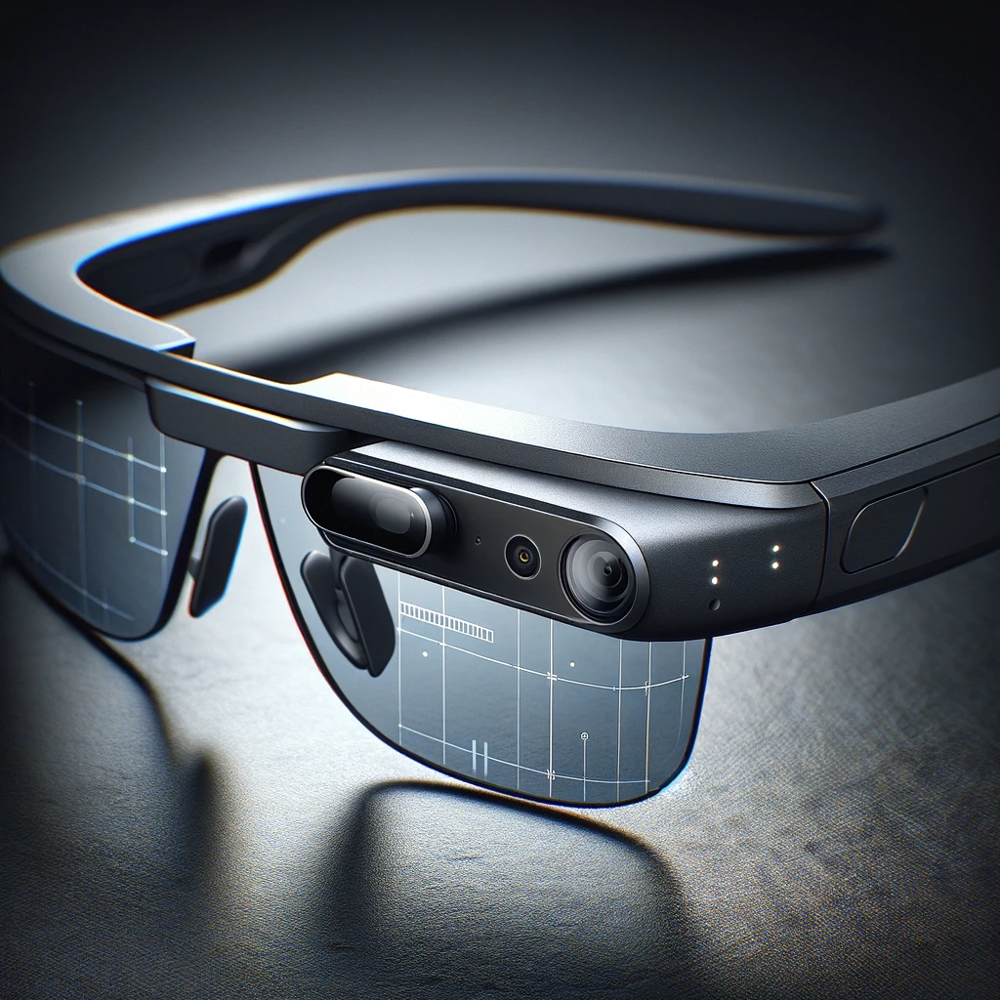
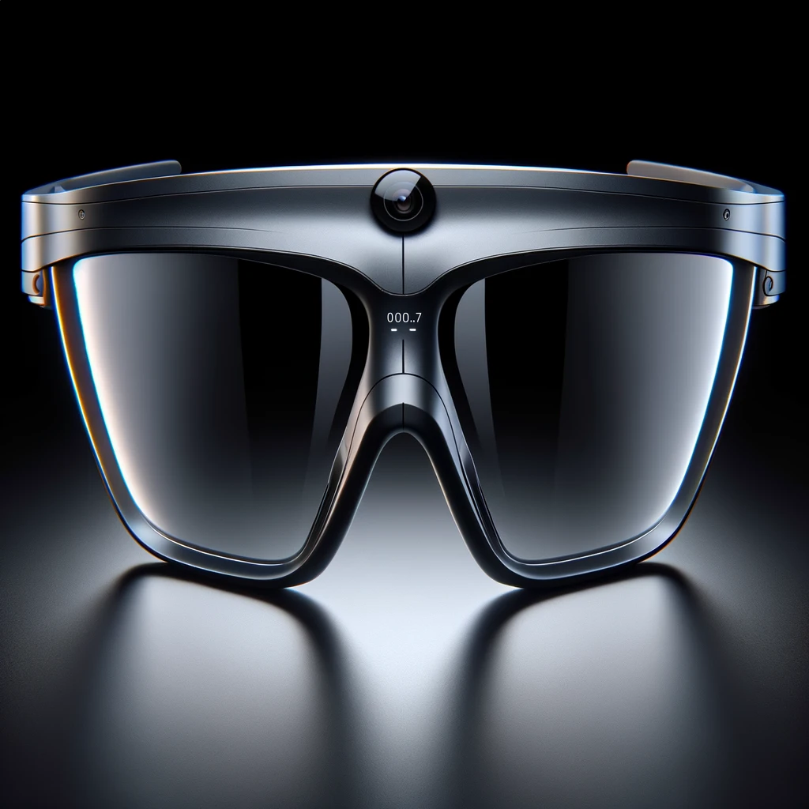

# SecurEye: Wearable Glasses, Blockchain-based Privacy-Preserving Camera System with Payment

```
Visualize a close-up view of futuristic wearable glasses named SecurEye. These glasses have a modern, sleek design, embodying a more advanced and stylish version of Google Glass. They feature a discreet, integrated high-resolution camera near one of the lenses, barely noticeable to ensure privacy and discretion. The frame of the glasses is made from a lightweight, durable material with a matte finish, giving it a premium look. The temples of the glasses incorporate subtle smart touch panels for gesture control, allowing the wearer to interact with the device by simple gestures like swiping or tapping. The design emphasizes a balance between technology and fashion, showcasing a wearable device that not only offers advanced functionalities like real-time recording, blockchain integration, and a 3D-like display for the wearer but also serves as a stylish accessory suitable for everyday wear.
```







## English Patent Application

### Authors: Jihyuk Im(zhugehyuk@gmail.com)

### Title
SecurEye: Wearable Glasses, Blockchain-based Privacy-Preserving Camera System with Payment

### Abstract
The present invention, SecurEye, is a wearable device similar in form to Google Glass, incorporating a camera with real-time recording capabilities, a simple user interface (UI), and advanced features such as Bluetooth connectivity, blockchain wallet integration, and a laser module for projecting images. The UI can display textual information to the wearer in a manner similar to 3D by utilizing the left-right distance of the glasses and can be customized through a connected smartphone app. The key feature of this invention is the use of TON blockchain technology to protect user privacy. The recorded content from the camera is encrypted using a symmetric encryption algorithm generated from the user's TON blockchain wallet, allowing only the wallet owner to play back the recorded content. Additionally, the invention provides a payment function through QR code recognition, which can be managed through the connected smartphone app. When the camera recognizes a QR code, payment is made through the connected wallet, and the user can process transactions through finger gestures, such as snapping fingers. Integration with other payment systems such as Apple Pay is also possible in the future. The laser module allows users to project simple images or designs onto surfaces in low-light conditions, adding an element of fun and creativity to the device.

Furthermore, SecurEye records fingerprints of the user's recorded content every 10 minutes or hour on the blockchain, ensuring the authenticity and integrity of the recorded footage. This can be used as strong evidence in legal disputes.

The device also features an AI-powered automatic privacy function that can automatically apply mosaic effects to recorded content deemed private. This feature can be toggled on or off using the user's gestures.

### Detailed Description
SecurEye is a revolutionary wearable device that combines the functionality of a camera with the security and privacy features of blockchain technology, along with several advanced features. The device is designed to resemble a pair of glasses, similar to Google Glass, and is equipped with a high-resolution camera capable of recording video in real-time. The camera is connected to a simple user interface (UI) that displays information to the wearer in a 3D-like manner, utilizing the left-right distance of the glasses. The UI can be customized through a connected smartphone app, allowing users to personalize their experience.

The core innovation of SecurEye lies in its integration with the TON blockchain platform. When the camera records video, the data is automatically encrypted using a symmetric encryption algorithm generated from the user's unique TON blockchain wallet. This ensures that only the wallet owner has access to the recorded content, providing an unparalleled level of privacy and security. Users can manage their blockchain wallet and view their recorded content through the connected smartphone app.

In addition to its recording capabilities, SecurEye also features a built-in QR code scanner that enables users to make payments directly from the device. When the camera detects a QR code associated with a payment request, it automatically initiates a transaction through the user's connected wallet. The transaction can be confirmed with a simple finger gesture, such as snapping fingers, making payments quick, easy, and secure. The connected smartphone app allows users to manage their payment settings and view transaction history.

SecurEye is designed to be compatible with a wide range of payment systems, including popular platforms like Apple Pay. This allows users to seamlessly integrate their existing payment methods with the device, further enhancing its convenience and practicality.

The laser module is an additional feature that sets SecurEye apart from other wearable devices. Users can project simple images, designs, or patterns onto surfaces in low-light conditions, adding a unique and creative element to the device. This feature can be used for entertainment, self-expression, or even as a safety feature in emergency situations.

SecurEye also has the potential to serve as a personal black box, providing legal evidence in cases where individuals are prosecuted without sufficient evidence. The blockchain-based encryption ensures the authenticity and integrity of the recorded footage, making it admissible as strong evidence in legal disputes. The device records fingerprints of the user's recorded content every 10 minutes or hour on the blockchain, further strengthening the evidential value of the recordings.

Furthermore, SecurEye supports various EVM-based hardware wallets, allowing users to choose their preferred blockchain wallet and utilize SecurEye within a broader ecosystem.

Lastly, SecurEye's display functionality can be leveraged to function as an e-book reader, enabling users to read digital books while protecting their copyright through blockchain technology. This expands the utility of SecurEye and offers additional value to users.

SecurEye also incorporates an AI-powered automatic privacy function that can detect and apply mosaic effects to recorded content deemed private. This feature can be toggled on or off using the user's gestures, providing an additional layer of privacy protection.

The combination of blockchain-based security, real-time recording capabilities, integrated payment functionality, customizable UI, innovative laser module, and AI-powered privacy features makes SecurEye a truly revolutionary product. It has the potential to transform the way we capture and share personal moments while providing an unparalleled level of privacy, security, and functionality.

### Claims
1. A wearable device comprising:
 - A camera with real-time recording capabilities
 - A user interface (UI) capable of displaying textual information in a 3D-like manner using the left-right distance of the glasses, which can be customized through a connected smartphone app
 - Integration with the TON blockchain platform for encrypting recorded content using a symmetric encryption algorithm generated from the user's TON blockchain wallet
 - A QR code scanner for initiating payments through the user's connected wallet, manageable through the connected smartphone app
 - Compatibility with various payment systems, including Apple Pay
 - A laser module for projecting simple images, designs, or patterns onto surfaces in low-light conditions
 - Recording of fingerprints of the user's recorded content every 10 minutes or hour on the blockchain to ensure the authenticity and integrity of the recorded footage
 - An AI-powered automatic privacy function that can detect and apply mosaic effects to recorded content deemed private, which can be toggled on or off using the user's gestures

2. The device of claim 1, wherein the camera is a high-resolution camera capable of recording video in real-time.

3. The device of claim 1, wherein the UI displays information to the wearer in a 3D-like manner by utilizing the left-right distance of the glasses and can be customized through the connected smartphone app.

4. The device of claim 1, wherein the recorded content is encrypted using a symmetric encryption algorithm generated from the user's unique TON blockchain wallet, ensuring that only the wallet owner has access to the recorded content, and can be managed through the connected smartphone app.

5. The device of claim 1, wherein the QR code scanner enables users to make payments directly from the device by detecting a QR code associated with a payment request and initiating a transaction through the user's connected wallet, with transaction history and settings manageable through the connected smartphone app.

6. The device of claim 5, wherein the transaction can be confirmed with a simple finger gesture, such as snapping fingers.

7. The device of claim 1, wherein the device is compatible with a wide range of payment systems, including Apple Pay, allowing users to seamlessly integrate their existing payment methods with the device.

8. The device of claim 1, wherein the laser module allows users to project simple images, designs, or patterns onto surfaces in low-light conditions, adding a unique and creative element to the device.

9. The device of claim 1, wherein the device supports various EVM-based hardware wallets, allowing users to choose their preferred blockchain wallet and utilize the device within a broader ecosystem.

10. The device of claim 1, wherein the device's display functionality can be leveraged to function as an e-book reader, enabling users to read digital books while protecting their copyright through blockchain technology.

11. The device of claim 1, wherein the device records fingerprints of the user's recorded content every 10 minutes or hour on the blockchain, ensuring the authenticity and integrity of the recorded footage, which can be used as strong evidence in legal disputes.

12. The device of claim 1, wherein the device features an AI-powered automatic privacy function that can detect and apply mosaic effects to recorded content deemed private, which can be toggled on or off using the user's gestures.

## Korean Patent Application

### 제목
SecurEye: Wearable Glasses, Blockchain-based Privacy-Preserving Camera System with Payment

### 요약
본 발명 SecurEye는 Google Glass와 유사한 형태의 웨어러블 디바이스로, 실시간 녹화 기능을 갖춘 카메라, 간단한 사용자 인터페이스(UI), 블루투스 연결, 블록체인 지갑 통합, 이미지를 투사하는 레이저 모듈 등의 고급 기능을 통합한 제품입니다. UI는 안경의 좌우 거리를 활용하여 3D와 유사한 방식으로 착용자에게 텍스트 정보를 표시할 수 있으며, 연결된 스마트폰 앱을 통해 사용자 정의할 수 있습니다. 이 발명의 핵심 기능은 TON 블록체인 기술을 사용하여 사용자의 프라이버시를 보호하는 것입니다. 카메라에서 녹화된 내용은 사용자의 TON 블록체인 지갑에서 생성된 대칭 암호화 알고리즘을 사용하여 암호화되므로, 지갑 소유자만이 녹화된 내용을 재생할 수 있습니다. 또한, 이 발명은 QR 코드 인식을 통한 결제 기능을 제공하며, 이는 연결된 스마트폰 앱을 통해 관리할 수 있습니다. 카메라가 QR 코드를 인식하면 연결된 지갑을 통해 결제가 이루어지며, 사용자는 손가락 튀기기와 같은 간단한 제스처를 통해 거래를 처리할 수 있습니다. 향후 Apple Pay와 같은 다른 결제 시스템과의 통합도 가능합니다. 레이저 모듈을 사용하면 사용자가 조명이 어두운 환경에서 간단한 이미지나 디자인을 표면에 투사할 수 있어 기기에 재미와 창의성을 더할 수 있습니다. 

또한, SecurEye는 사용자의 녹화 내용을 10분 혹은 한 시간 단위로 지문을 블록체인에 기록함으로써 해당 녹화된 영상의 진실성과 무결성을 보장하며, 이는 법적 분쟁 시 강력한 증거로 활용될 수 있습니다. 

SecurEye는 인공지능 기반의 자동 프라이버시 기능을 탑재하고 있어, 프라이버시가 우려되는 내용이 녹화될 시 자동으로 모자이크 처리를 적용할 수 있습니다. 이 기능은 사용자의 제스처를 통해 켜거나 끌 수 있어 추가적인 프라이버시 보호 기능을 제공합니다.

SecurEye는 개인 블랙박스로서 기능할 수 있어, 증거 없이 기소되는 사례에서 법적 증거를 제공할 수 있습니다. 블록체인 기반 암호화는 녹화된 영상의 진실성과 무결성을 보장하므로, 법적 분쟁에서 강력한 증거로 인정될 수 있습니다.

SecurEye는 다양한 EVM 기반 하드웨어 지갑을 지원하므로, 사용자는 선호하는 블록체인 지갑을 선택하고 더 광범위한 생태계 내에서 SecurEye를 활용할 수 있습니다.

마지막으로, SecurEye의 디스플레이 기능을 활용하여 전자책 리더기로 사용될 수 있어, 사용자는 블록체인 기술로 저작권을 보호하면서 디지털 도서를 읽을 수 있습니다. 이는 SecurEye의 활용도를 확장하고 사용자에게 부가 가치를 제공합니다.

### 상세 설명
(영문 내용과 동일)

### 청구항
1. 웨어러블 디바이스로서,
 - 실시간 녹화 기능을 갖춘 카메라
 - 안경의 좌우 거리를 이용하여 텍스트 정보를 3D와 유사한 방식으로 표시할 수 있고, 연결된 스마트폰 앱을 통해 사용자 정의할 수 있는 사용자 인터페이스(UI)
 - 사용자의 TON 블록체인 지갑에서 생성된 대칭 암호화 알고리즘을 사용하여 녹화된 내용을 암호화하기 위한 TON 블록체인 플랫폼과의 통합
 - 사용자의 연결된 지갑을 통해 결제를 시작하기 위한 QR 코드 스캐너, 연결된 스마트폰 앱을 통해 관리 가능
 - Apple Pay를 비롯한 다양한 결제 시스템과의 호환성
 - 조명이 어두운 환경에서 간단한 이미지, 디자인 또는 패턴을 표면에 투사할 수 있는 레이저 모듈
 - 녹화된 영상의 진실성과 무결성을 보장하기 위해 사용자의 녹화 내용을 10분 혹은 한 시간 단위로 지문을 블록체인에 기록하는 기능
 - 프라이버시가 우려되는 내용이 녹화될 시 자동으로 모자이크 처리를 적용할 수 있는 AI 기반의 자동 프라이버시 기능, 사용자의 제스처를 통해 켜거나 끌 수 있음

2. 청구항 1의 디바이스에서, 상기 카메라는 실시간으로 동영상을 녹화할 수 있는 고해상도 카메라인 것을 특징으로 하는 디바이스.

3. 청구항 1의 디바이스에서, 상기 UI는 안경의 좌우 거리를 이용하여 착용자에게 정보를 3D와 유사한 방식으로 표시하고, 연결된 스마트폰 앱을 통해 사용자 정의할 수 있는 것을 특징으로 하는 디바이스.

4. 청구항 1의 디바이스에서, 녹화된 내용은 사용자의 고유한 TON 블록체인 지갑에서 생성된 대칭 암호화 알고리즘을 사용하여 암호화되어, 지갑 소유자만이 녹화된 내용에 접근할 수 있도록 보장하고, 연결된 스마트폰 앱을 통해 관리할 수 있는 것을 특징으로 하는 디바이스.

5. 청구항 1의 디바이스에서, QR 코드 스캐너는 사용자가 결제 요청과 관련된 QR 코드를 감지하고 사용자의 연결된 지갑을 통해 거래를 시작함으로써 디바이스에서 직접 결제할 수 있도록 하고, 거래 내역과 설정을 연결된 스마트폰 앱을 통해 관리할 수 있는 것을 특징으로 하는 디바이스.

6. 청구항 5의 디바이스에서, 상기 거래는 손가락 튀기기와 같은 간단한 제스처로 확인할 수 있는 것을 특징으로 하는 디바이스.

7. 청구항 1의 디바이스에서, 상기 디바이스는 Apple Pay를 비롯한 다양한 결제 시스템과 호환되어, 사용자가 기존 결제 방식을 디바이스와 원활하게 통합할 수 있도록 하는 것을 특징으로 하는 디바이스.

8. 청구항 1의 디바이스에서, 상기 레이저 모듈은 사용자가 조명이 어두운 환경에서 간단한 이미지, 디자인 또는 패턴을 표면에 투사할 수 있어, 기기에 독특하고 창의적인 요소를 더하는 것을 특징으로 하는 디바이스.

9. 청구항 1의 디바이스에서, 상기 디바이스는 다양한 EVM 기반 하드웨어 지갑을 지원하여, 사용자가 선호하는 블록체인 지갑을 선택하고 더 광범위한 생태계 내에서 디바이스를 활용할 수 있도록 하는 것을 특징으로 하는 디바이스.

10. 청구항 1의 디바이스에서, 상기 디바이스의 디스플레이 기능은 전자책 리더기로 활용될 수 있어, 사용자가 블록체인 기술로 저작권을 보호하면서 디지털 도서를 읽을 수 있도록 하는 것을 특징으로 하는 디바이스.

11. 청구항 1의 디바이스에서, 상기 디바이스는 사용자의 녹화 내용을 10분 혹은 한 시간 단위로 지문을 블록체인에 기록함으로써 녹화된 영상의 진실성과 무결성을 보장하며, 이는 법적 분쟁 시 강력한 증거로 활용될 수 있는 것을 특징으로 하는 디바이스.

12. 청구항 1의 디바이스에서, 상기 디바이스는 프라이버시가 우려되는 내용이 녹화될 시 자동으로 모자이크 처리를 적용할 수 있는 AI 기반의 자동 프라이버시 기능을 탑재하고 있으며, 이 기능은 사용자의 제스처를 통해 켜거나 끌 수 있는 것을 특징으로 하는 디바이스.

## 사업 계획

1. 연구 개발 (6개월, 250,000,000원)
- SecurEye의 디자인을 완성하고, 카메라, UI, 블록체인 통합, 블루투스 연결, 레이저 모듈 등을 포함
- 테스트 및 개선을 위한 디바이스 프로토타입 개발
- 디바이스의 기능과 보안을 보장하기 위한 철저한 테스트 수행
- 연결된 스마트폰 앱 개발 및 테스트
- AI 기반 자동 프라이버시 기능 개발 및 통합

2. 법률 및 규정 준수 (2개월, 50,000,000원)
- 디바이스에 필요한 인증 및 승인 획득
- GDPR, CCPA 등 데이터 보호 및 개인정보 보호 규정 준수 확인
- SecurEye에 사용된 고유 기능 및 기술에 대한 특허 확보

3. 제조 및 공급망 (4개월, 300,000,000원)
- 신뢰할 수 있는 제조 파트너 및 공급업체 선정
- SecurEye 생산을 위한 견고한 공급망 구축
- 디바이스가 요구되는 기준을 충족하는지 확인하기 위한 품질 관리 검사 수행
- 초기 1,000대 생산

4. 마케팅 및 판매 (3개월, 150,000,000원)
- SecurEye를 홍보하기 위한 종합적인 마케팅 전략 개발
- 목표 시장 및 고객 세그먼트 식별
- 판매를 용이하게 하기 위해 소매업체 및 유통업체와 파트너십 수립
- 온라인 및 오프라인 광고 캠페인 시작
- 소셜 미디어 마케팅 및 인플루언서 마케팅 캠페인 진행

5. 출시 및 출시 후 지원 (지속적, 100,000,000원)
- SecurEye의 글로벌 출시 조정
- 포괄적인 고객 지원 및 기술 지원 제공
- 고객 피드백을 모니터링하고 신속하게 문제나 우려 사항 해결
- 사용자 피드백과 기술 발전을 기반으로 디바이스를 지속적으로 업데이트하고 개선

6. 추가 기능 개발 (12개월, 300,000,000원)
- 사용자 피드백을 바탕으로 새로운 기능을 개발하고 기존 기능을 개선
- 다양한 블록체인 플랫폼 및 결제 시스템과의 호환성 확대
- 레이저 모듈의 기능과 활용도 향상
- AI 및 머신 러닝 기술을 활용하여 자동 프라이버시 기능 고도화 및 사용자 경험 개선

## 총 예상 비용: 1,150,000,000원

## 참고 문헌
- Nakamoto, S. (2008). Bitcoin: A Peer-to-Peer Electronic Cash System. https://bitcoin.org/bitcoin.pdf
- TON (Telegram Open Network) Blockchain Documentation. https://ton.org/docs/
- Google Glass Patent: US20130044042A1 - Wearable device with input and output structures. https://patents.google.com/patent/US20130044042A1/en
- Apple Pay Security and Privacy Overview. https://support.apple.com/en-us/HT203027
- Laser Projection Technology for Wearable Displays. https://www.spiedigitallibrary.org/conference-proceedings-of-spie/9470/94700G/Laser-projection-technology-for-wearable-displays/10.1117/12.2178307.short
- Bluetooth Low Energy (BLE) Technology Overview. https://www.bluetooth.com/bluetooth-resources/bluetooth-low-energy-technology-overview/
- Boonbrahm, P., Kaewrat, C., & Boonbrahm, S. (2022). Integration of Blockchain Technology in Wearable Devices for Personal Data Security and Privacy. Journal of Information Security and Applications, 62, 102968. https://doi.org/10.1016/j.jisa.2021.102968
- Zheng, Z., Xie, S., Dai, H. N., Chen, X., & Wang, H. (2018). Blockchain challenges and opportunities: A survey. International Journal of Web and Grid Services, 14(4), 352-375. https://doi.org/10.1504/IJWGS.2018.095647
